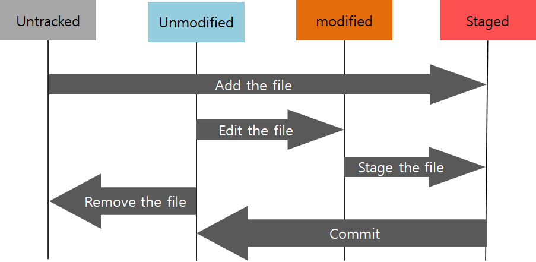

# 2022년 7월 6일


## Git이란

분산버전관리시스템으로 코드의 버전을 관리하는 도구

컴퓨터 파일의 변경사항을 추적하고 여러 명의 사용자들 간에 해당 파일들의 작업을 조율


## Git 기본 흐름

`modified` : 파일이 수정된 상태 [modified 사전적 의미](https://dict.naver.com/search.dict?dicQuery=modified&query=modified&target=dic&ie=utf8&query_utf=&isOnlyViewEE=)

`staged` : 수정한 파일을 곧 커밋할 것이라고 표시한 상태 [staged 사전적 의미](https://dict.naver.com/search.dict?dicQuery=staged&query=staged&target=dic&ie=utf8&query_utf=&isOnlyViewEE=)

`committed` : 커밋이 된 상태 [committed 사전적 의미](https://dict.naver.com/search.dict?dicQuery=committed&query=committed&target=dic&ie=utf8&query_utf=&isOnlyViewEE=)





## git 명령어

`$ cd ~` : 홈 디렉토리 이동

`$ cd <디렉토리명>` : 디렉토리명으로 이동

`$ cd ..` : 부모(상위) 디렉토리 이동

`$ pwd` : 현재 디렉토리 출력

`$ ls` : 파일 목록 표시

`$ ls -l` : 디렉토리 폴더 상세정보까지 출력

`$ ls -a` : 디렉토리 숨김파일과 디렉토리까지 출력

`$ mkdir <디렉토리명> ` : 새 디렉토리에 디렉토리명 생성

`$ clear` : 터미널 창 내용 삭제

`$  exit` :  터미널 창 종료

`$ rm <파일명>` : 파일 삭제

`$ rm -r <디렉토리명>` : 디렉토리 삭제

`$ rm -r.git` : git init 취소


## git 업로드

`$ git init` : 현재 위치에서 로컬 저장소 생성, 저장소 처음 만들때

`$ git config --global user.name "<u>사용자명</u>"

`$ git status` : 깃 상태 확인
`$ git add .` : 버전을 기록할 때
$ git commit -m '커밋메시지'

상태 확인할 때
$ git status : 1통, 2통
$ git log : 커밋 확인git log : 커밋 확인

원격저장소 정보 확인
$ git remote –V

원격저장소에 변경사항(커밋) 올림
$ git push <원격저장소이름><브랜치이름>


`$ git status`

## git user name 변경


```bash
# 설정 변경하기
$ git config --global user.name "id"
$ git config --global user.email "email"
# 확인하기
$ git config --global --list 
```

폴더 안에서 git파일 삭제하면 모든 버전이 지워짐


## git  log 명령어

`$ git log` : 현재 저장소에 기록된 커밋을 조회, 다양한 옵션을 통해 로그 조회 가능

`$ git log -n(숫자)` : 전체 커밋 중 최신 n개의 커밋 조회

`$ git log --oneline` : 현재 커밋을 한 줄로 요약해서 보여줌, *(모든 브랜치들을 보고 싶을 때 사용)*

`$ git log --graph` : 커밋 옆에 브랜치의 흐름을 그래프로 보여줌, (*모든 브랜치들을 보고 싶을 때 사용)*

`$ git log --decorate` : 브랜치와 태그 등의 참조를 간결히 표시, *(모든 브랜치들을 보고 싶을 때 사용)*

$ ` git log --all` : 옵션이 없을 경우 HEAD와 관계 없는 옵션은 보여주지 않음, *(모든 브랜치들을 보고 싶을 때 사용)*

> <u>솔직히 아직까지 `--graph` `--decorate` `--all`은 뭔지 잘 모르겠음</u>

`$ git log --oneline --reverse` : 오래된 커밋부터 보고싶을 때

> ex1)  `$ git log -1 : 전체 커밋 중 최신 1개의 커밋 조회 `
>
> ex2) `$ git log -2 --oneline : 전체 커밋 중 최신 2개의 커밋을 한 줄로 요약해서 보여줌 `


`$ gitkeep` : Git은 빈 디렉토리를 추가할 수 없기 때문에 관용적으로 파일만 만들고 싶을 때 사용

​					빈 폴더는 터미널에 `git status`를 사용해도 나타나지 않기 때문

​					즉, 빈 디렉토리를 유지하는 것이 목표

`$ gitignore` : Git 버전 관리에서 제외할 파일 목록을 지정하는 파일, 사용자가 원하지 않는 파일


## 터미널 tip

`ctrl + c` : 커맨드를 넣다가 해당 줄을 탈출하고 싶을때 사용

`ctrl + shift + c` : 복사

`ctrl + shift +v ` `shift + insert` `마우스 우클릭` : 붙여넣기


붙여넣기 단축키가 `ctrl + v `아님

붙여넣기 단축키는 `shift + insert`, `우클릭`


> 원격저장소 설정 기본 명령어

`git clone` : 원격 저장소 복제

`git remote –v` : 원격저장소 정보 확인

`git remote add <원격저장소> <url>` : 원격저장소 추가 (일반적으로 origin)

`git remote rm <원격저장소>` : 원격저장소 삭제

`git push  <원격저장소>  <브랜치>` : 원격저장소에 push

`git pull <원격저장소>  <브랜치>` : 원격저장소로부터 pul


`git log 

깃허브 할때

원칙 1. 로컬에서만 편집(수정, 삭제, 생성)

 -> 혼자 작업할 때 볼일 없음


원칙 2. 작업 전에 

$git pull orgin master


secret.csv

secret/ : 파일 git status해도 안보임

와일드 카드로 *.exe를 하면 확장자가 exe가 붙은건 안보이게 해줌


githob.io나 jekyll, 벨로그 등 기술 블로그에서 많이 블로그 활동을 함

git push -u origin master 를 한번 입력하시면 나중에는 git push 만 입력


저장소 만들고 난 후

`$ git remote add origin https://github.com/<GitHub Username>/<저장소이름>`

해줘야 됨

remote : 원격저장소

add origin : 오리진으로 추가


`$ git push <원격저장소이름> <브랜치이름>`

: 원격 저장소로 로컬 저장소 변경사항(커밋)을 올림


`$ git pull <원격저장소이름> <브랜치이름>`

: 원격 저장소로부터 변경된 내역을 받아와서 이력을 병합


`$ git clone <원격저장소주소>`

: 원격 저장소 복제하여 가져옴, 로컬 저장소 없는데 가져오고 싶을때 사용

